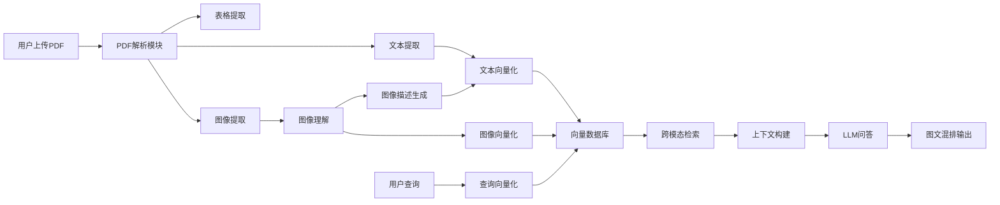

## 多模态RAG聊天框项目 - 产品需求文档

### 1. 项目概述

#### 1.1 项目背景
随着企业数字化转型的深入，核心知识资产不再局限于纯文本形式，大量专业信息以PDF报告、扫描件、财务图表、设计图稿等多模态形式存在。传统文本RAG或OCR技术存在诸多局限性：
- 深度语义理解不足，无法精准把握图表数据趋势、图像对象关系及复杂PDF版面结构
- 跨模态检索能力欠缺，难以实现"用文本问题检索相关图像或图表"的高级需求
- 大模型适用性差，缺乏将多模态数据高效转化为LLM可用Context的处理管道

#### 1.2 项目目标
- **文档深度解析**：构建PDF解析pipeline，提取文本、图表、图像，并实现自动识别和关键信息提取
- **多模态向量库**：利用CLIP或Qwen-VL等模型，实现文本和图像的统一向量化，搭建支持跨模态检索的向量数据库
- **多模态问答**：将多模态知识整合为Context输入LLM，实现图文混合的高级问答

---

### 2. 功能需求

#### 2.1 文档上传与解析模块
| 需求点 | 描述 | 优先级 |
| :--- | :--- | :--- |
| PDF上传 | 支持上传PDF文档（单文件/批量） | 高 |
| 文档结构化解析 | 分离纯文本、表格、图像三大要素 | 高 |
| 图表识别 | 自动识别图表类型（柱状图、折线图、饼图等） | 高 |
| OCR识别 | 对扫描件或图像中的文字进行识别 | 中 |
| 文档元数据提取 | 提取文档标题、作者、页数等元信息 | 中 |

#### 2.2 多模态向量化模块
| 需求点 | 描述 | 优先级 |
| :--- | :--- | :--- |
| 文本向量化 | 使用CLIP/Qwen-VL模型将文本转为向量 | 高 |
| 图像向量化 | 使用CLIP/Qwen-VL模型将图像转为向量 | 高 |
| 图表描述生成 | 生成图表的结构化文本描述 | 高 |
| 向量存储 | 将向量存储到向量数据库 | 高 |

#### 2.3 跨模态检索模块
| 需求点 | 描述 | 优先级 |
| :--- | :--- | :--- |
| 文本查询 | 支持自然语言查询 | 高 |
| 跨模态召回 | 根据文本查询召回相关图像/图表 | 高 |
| 混合排序 | 综合文本和图像相似度进行排序 | 高 |
| 检索结果预览 | 展示检索到的文本片段、图像缩略图 | 高 |

#### 2.4 多模态问答模块
| 需求点 | 描述 | 优先级 |
| :--- | :--- | :--- |
| 上下文构建 | 将检索到的文本、图像描述整合为增强Context | 高 |
| LLM问答 | 将Context输入LLM进行问答 | 高 |
| 图文混排输出 | 支持文本、图像URL混合展示 | 高 |
| 多轮对话 | 支持上下文保持的多轮问答 | 高 |

#### 2.5 管理后台模块
| 需求点 | 描述 | 优先级 |
| :--- | :--- | :--- |
| 文档管理 | 查看、删除已上传的文档 | 中 |
| 向量库管理 | 查看向量库状态、重建索引 | 中 |
| 查询日志 | 记录用户查询历史 | 低 |

---

### 3. 非功能需求

#### 3.1 性能需求
| 指标 | 要求 |
| :--- | :--- |
| PDF解析时间 | 单页PDF < 5秒 |
| 向量检索时间 | < 1秒 |
| 问答响应时间 | < 10秒（含LLM响应） |

#### 3.2 可扩展性需求
| 指标 | 要求 |
| :--- | :--- |
| 支持文档数量 | ≥ 10000份 |
| 支持并发用户 | ≥ 100 |
| 支持水平扩展 | 通过Kafka实现分布式处理 |

#### 3.3 安全性需求（Demo版本）
| 需求 | 描述 |
| :--- | :--- |
| 文档加密存储 | 敏感文档需加密 |
| 数据脱敏 | 输出内容需脱敏处理 |

> **注意**：本项目为Demo版本，暂不包含用户认证与角色权限管理功能。生产环境部署时建议添加JWT Token认证、角色权限管理等安全机制。

---

### 4. 技术约束

| 约束项 | 说明 |
| :--- | :--- |
| 模型部署方式 | CLIP/Qwen-VL需本地部署 |
| 向量数据库选择 | 支持Milvus/FAISS/Pinecone |
| 消息队列 | 使用Kafka进行分布式处理 |
| 文档解析工具 | 使用MinerU进行PDF解析 |

---

### 5. 数据流向

---

### 6. 原型设计要点

#### 6.1 聊天界面
- 左侧：文档列表/检索结果
- 中间：聊天消息区域（支持图文混排）
- 右侧：当前检索到的相关图像预览

#### 6.2 文档上传界面
- 拖拽上传区域
- 支持批量选择
- 上传进度显示

#### 6.3 检索结果展示
- 文本片段高亮显示
- 图像缩略图网格布局
- 相似度评分展示

---

### 7. 交付物清单

| 阶段 | 交付物 | 描述 |
| :--- | :--- | :--- |
| 需求阶段 | PRD文档 | 本文件 |
| 设计阶段 | 技术架构文档 | 系统架构、模块划分、技术选型 |
| 设计阶段 | API接口文档 | 接口定义、参数说明 |
| 开发阶段 | 代码实现 | 完整的后端服务和前端界面 |
| 测试阶段 | 测试报告 | 功能测试、性能测试结果 |
| 部署阶段 | 部署文档 | 部署指南、配置说明 |

---

### 8. 项目计划

| 阶段 | 时间 | 主要任务 |
| :--- | :--- | :--- |
| 需求分析 | 1周 | 完成PRD文档 |
| 技术设计 | 1周 | 完成技术架构和API设计 |
| 核心开发 | 3周 | 文档解析、向量化、检索模块 |
| 集成测试 | 1周 | 系统联调、BUG修复 |
| 部署上线 | 1周 | 环境部署、性能优化 |