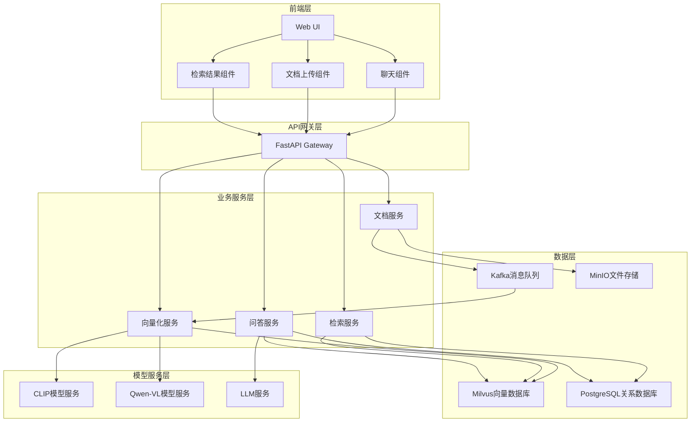
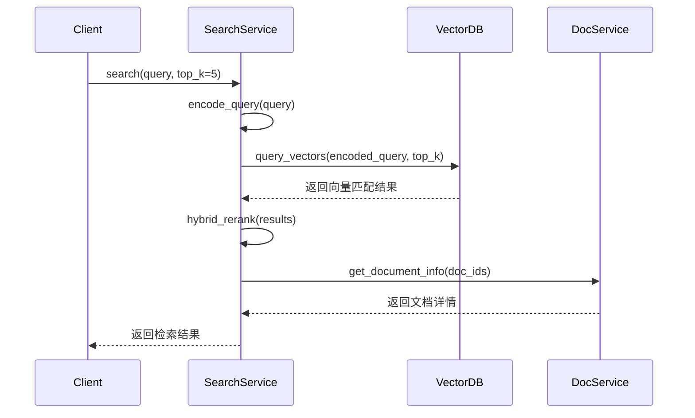
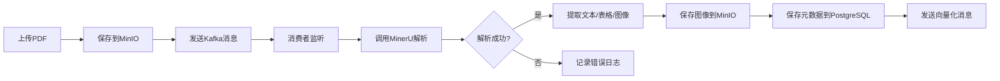
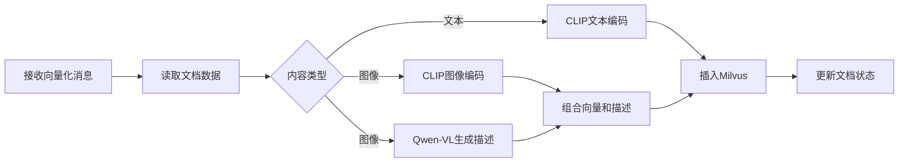
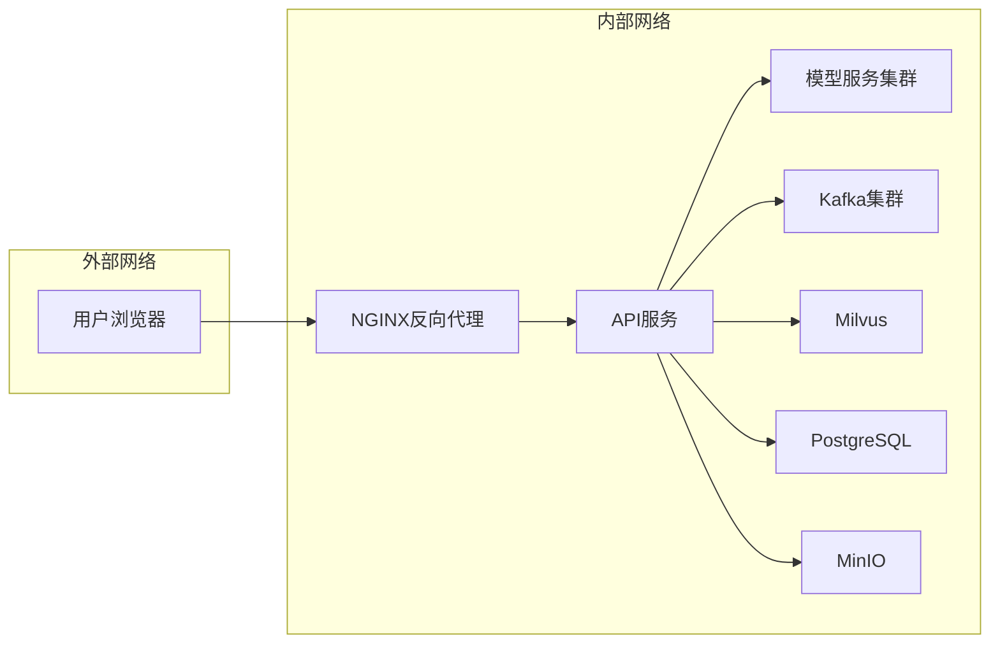

## 多模态RAG聊天框项目 - 技术架构设计文档

### 1. 系统架构

#### 1.1 整体架构图



#### 1.2 架构说明

| 层级 | 组件 | 职责 |
| :--- | :--- | :--- |
| 前端层 | Web UI | 用户交互界面，包含聊天、上传、检索结果展示 |
| API网关层 | FastAPI Gateway | 统一API入口，请求路由、认证、限流 |
| 业务服务层 | 文档服务/向量化服务/检索服务/问答服务 | 核心业务逻辑处理 |
| 模型服务层 | CLIP/Qwen-VL/LLM | 多模态模型推理服务 |
| 数据层 | Kafka/Milvus/PostgreSQL/MinIO | 消息队列、向量存储、关系数据、文件存储 |

---

### 2. 技术选型

#### 2.1 后端技术栈

| 分类 | 技术 | 版本 | 选型理由 |
| :--- | :--- | :--- | :--- |
| 语言 | Python | 3.10+ | 丰富的AI/ML生态，适合模型部署 |
| 框架 | FastAPI | 0.100+ | 高性能异步框架，自动生成API文档 |
| 消息队列 | Kafka | 3.5+ | 分布式消息传递，支持高吞吐量 |
| 向量数据库 | Milvus | 2.3+ | 开源向量数据库，支持多模态检索 |
| 关系数据库 | PostgreSQL | 15+ | 支持JSON类型，适合存储文档元数据 |
| 文件存储 | MinIO | 2023+ | 轻量级对象存储，支持S3协议 |
| ORM | SQLAlchemy | 2.0+ | 支持异步操作，与FastAPI集成良好 |

#### 2.2 模型技术栈

| 分类 | 模型 | 用途 |
| :--- | :--- | :--- |
| 多模态模型 | CLIP | 图像-文本统一向量化 |
| 多模态模型 | Qwen-VL | 图文理解、图表描述生成 |
| 大语言模型 | Qwen-7B/14B | 问答生成 |
| PDF解析 | MinerU | 本地PDF结构化解析 |
| OCR | PaddleOCR | 图像文字识别 |

#### 2.3 前端技术栈

| 分类 | 技术 | 版本 | 选型理由 |
| :--- | :--- | :--- | :--- |
| 框架 | React | 18+ | 成熟的前端框架，生态完善 |
| 样式 | TailwindCSS | 3+ | 快速构建UI，响应式设计 |
| 状态管理 | Redux Toolkit | 1.9+ | 集中式状态管理 |
| 图表 | Chart.js | 4+ | 数据可视化 |

---

### 3. 模块设计

#### 3.1 文档服务模块

**功能职责**：文档上传、PDF解析、文件管理

**核心类与方法**：

| 类名 | 方法 | 功能说明 |
| :--- | :--- | :--- |
| DocumentService | upload_document() | 接收上传的PDF文件 |
| DocumentService | parse_pdf() | 调用MinerU解析PDF |
| DocumentService | extract_elements() | 分离文本、表格、图像 |
| DocumentService | save_to_storage() | 保存文件到MinIO |
| DocumentService | get_document_list() | 获取文档列表 |

**数据模型**：

```python
class Document(BaseModel):
    id: str
    name: str
    file_path: str
    page_count: int
    status: str  # pending/processing/complete/failed
    created_at: datetime
    updated_at: datetime
```

#### 3.2 向量化服务模块

**功能职责**：文本/图像向量化、向量存储

**核心类与方法**：

| 类名 | 方法 | 功能说明 |
| :--- | :--- | :--- |
| VectorizationService | encode_text() | 使用CLIP/Qwen-VL编码文本 |
| VectorizationService | encode_image() | 使用CLIP/Qwen-VL编码图像 |
| VectorizationService | generate_description() | 使用Qwen-VL生成图像描述 |
| VectorizationService | insert_vectors() | 插入向量到Milvus |
| VectorizationService | delete_vectors() | 从Milvus删除向量 |

**数据模型**：

```python
class VectorRecord(BaseModel):
    id: str
    document_id: str
    chunk_id: str
    content: str  # 文本内容或图像描述
    content_type: str  # text/image/table
    vector: list[float]
    metadata: dict
```

#### 3.3 检索服务模块

**功能职责**：跨模态检索、结果排序

**核心类与方法**：

| 类名 | 方法 | 功能说明 |
| :--- | :--- | :--- |
| SearchService | search() | 执行跨模态检索 |
| SearchService | encode_query() | 编码查询文本 |
| SearchService | hybrid_rerank() | 混合排序算法 |
| SearchService | get_top_k() | 获取top-k结果 |

**检索流程**：



#### 3.4 问答服务模块

**功能职责**：上下文构建、LLM问答、图文混排

**核心类与方法**：

| 类名 | 方法 | 功能说明 |
| :--- | :--- | :--- |
| QA Service | build_context() | 构建增强上下文 |
| QA Service | generate_answer() | 调用LLM生成答案 |
| QA Service | format_response() | 图文混排格式化 |
| QA Service | maintain_history() | 维护对话历史 |

**提示词模板**：

```
你是一个多模态知识问答助手。请根据提供的参考资料（文本和图像描述）回答用户问题。

参考资料：
{context}

用户问题：
{question}

请按照以下格式输出：
- 答案：[你的回答]
- 引用来源：[引用的参考资料ID]
```

---

### 4. 数据库设计

#### 4.1 关系数据库表设计

**documents表**：

| 字段名 | 类型 | 约束 | 说明 |
| :--- | :--- | :--- | :--- |
| id | VARCHAR(36) | PRIMARY KEY | 文档唯一标识 |
| name | VARCHAR(255) | NOT NULL | 文档名称 |
| file_path | VARCHAR(512) | NOT NULL | MinIO存储路径 |
| page_count | INT | NOT NULL | 页数 |
| status | VARCHAR(20) | NOT NULL | 处理状态 |
| created_at | TIMESTAMP | NOT NULL | 创建时间 |
| updated_at | TIMESTAMP | NOT NULL | 更新时间 |

**chunks表**：

| 字段名 | 类型 | 约束 | 说明 |
| :--- | :--- | :--- | :--- |
| id | VARCHAR(36) | PRIMARY KEY | 片段唯一标识 |
| document_id | VARCHAR(36) | FOREIGN KEY | 所属文档ID |
| content_type | VARCHAR(20) | NOT NULL | text/image/table |
| content | TEXT | NOT NULL | 内容或描述 |
| page_number | INT | NOT NULL | 页码 |
| position | JSON | | 在页面上的位置信息 |

**conversations表**（Demo版本）：

| 字段名 | 类型 | 约束 | 说明 |
| :--- | :--- | :--- | :--- |
| id | VARCHAR(36) | PRIMARY KEY | 对话唯一标识 |
| created_at | TIMESTAMP | NOT NULL | 创建时间 |

> **注意**：Demo版本暂不关联用户ID，生产环境建议添加user_id字段实现用户隔离。

**messages表**：

| 字段名 | 类型 | 约束 | 说明 |
| :--- | :--- | :--- | :--- |
| id | VARCHAR(36) | PRIMARY KEY | 消息唯一标识 |
| conversation_id | VARCHAR(36) | FOREIGN KEY | 所属对话ID |
| role | VARCHAR(20) | NOT NULL | user/assistant |
| content | TEXT | NOT NULL | 消息内容 |
| references | JSON | | 引用的chunk ID列表 |
| created_at | TIMESTAMP | NOT NULL | 创建时间 |

#### 4.2 向量数据库设计

**milvus_collection**：

| 字段名 | 类型 | 说明 |
| :--- | :--- | :--- |
| id | VARCHAR(36) | 主键 |
| chunk_id | VARCHAR(36) | 关联的chunk ID |
| vector | FLOAT_VECTOR | 向量数据（维度根据模型确定） |
| content_type | VARCHAR(20) | text/image/table |
| document_id | VARCHAR(36) | 所属文档ID |

---

### 5. 关键技术实现

#### 5.1 PDF解析流程



#### 5.2 向量化流程



#### 5.3 跨模态检索算法

```
1. 将用户查询文本使用CLIP文本编码器编码为向量
2. 在Milvus中执行向量相似度检索
3. 获取top-k候选结果（包含文本、图像向量）
4. 对文本结果使用BM25算法重新打分
5. 融合向量相似度和BM25分数进行排序
6. 返回最终排序后的结果
```

---

### 6. 部署架构

#### 6.1 容器化部署

**Docker Compose服务**：

| 服务名 | 镜像 | 端口 | 说明 |
| :--- | :--- | :--- | :--- |
| api | 自定义Python镜像 | 8000 | FastAPI服务 |
| kafka | confluentinc/cp-kafka | 9092 | 消息队列 |
| zookeeper | confluentinc/cp-zookeeper | 2181 | Kafka依赖 |
| milvus | milvusdb/milvus | 19530 | 向量数据库 |
| postgres | postgres:15 | 5432 | 关系数据库 |
| minio | minio/minio | 9000 | 对象存储 |
| clip | 自定义CLIP服务镜像 | 5000 | CLIP模型服务 |
| qwen-vl | 自定义Qwen-VL镜像 | 5001 | Qwen-VL模型服务 |
| llm | 自定义LLM镜像 | 5002 | LLM服务 |

#### 6.2 网络拓扑



---

### 7. 安全设计（Demo版本）

#### 7.1 数据安全

| 措施 | 说明 |
| :--- | :--- |
| 文档加密 | 敏感文档AES加密存储 |
| 传输加密 | HTTPS/TLS加密 |
| 数据脱敏 | 输出内容敏感信息自动脱敏 |
| 访问日志 | 记录所有API访问日志 |

> **注意**：本项目为Demo版本，暂不包含用户认证与授权功能。生产环境部署时建议添加JWT Token认证、角色权限管理等安全机制。

---

### 8. 监控与日志

#### 8.1 监控指标

| 指标 | 监控对象 |
| :--- | :--- |
| API响应时间 | FastAPI服务 |
| 消息队列堆积 | Kafka |
| 向量检索耗时 | Milvus |
| 模型推理耗时 | CLIP/Qwen-VL/LLM |
| 存储使用率 | MinIO/PostgreSQL |

#### 8.2 日志规范

| 日志级别 | 使用场景 |
| :--- | :--- |
| DEBUG | 详细调试信息 |
| INFO | 正常业务流程 |
| WARNING | 异常但不影响运行 |
| ERROR | 错误需要关注 |
| CRITICAL | 严重错误需要立即处理 |