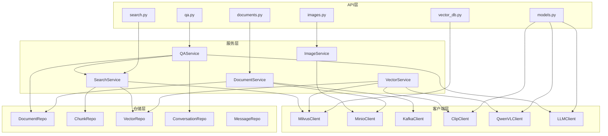

## 多模态RAG聊天框项目 - 目录结构规划

### 1. 项目目录结构

```
multimodal-rag-chatbox/
├── backend/                          # 后端代码
│   ├── app/                          # 应用根目录
│   │   ├── __init__.py
│   │   ├── main.py                   # FastAPI入口文件
│   │   ├── api/                      # API路由层
│   │   │   ├── __init__.py
│   │   │   ├── v1/                   # API v1版本
│   │   │   │   ├── __init__.py
│   │   │   │   ├── documents.py      # 文档管理接口
│   │   │   │   ├── search.py         # 检索接口
│   │   │   │   ├── qa.py             # 问答接口
│   │   │   │   ├── images.py         # 图像服务接口
│   │   │   │   ├── vector_db.py      # 向量库管理接口
│   │   │   │   └── models.py         # 模型服务接口
│   │   ├── core/                     # 核心模块
│   │   │   ├── __init__.py
│   │   │   ├── config.py             # 配置管理
│   │   │   └── logging.py            # 日志配置
│   │   ├── services/                 # 业务服务层
│   │   │   ├── __init__.py
│   │   │   ├── document_service.py   # 文档服务
│   │   │   ├── vector_service.py     # 向量化服务
│   │   │   ├── search_service.py     # 检索服务
│   │   │   ├── qa_service.py         # 问答服务
│   │   │   └── image_service.py      # 图像服务
│   │   ├── models/                   # 数据模型
│   │   │   ├── __init__.py
│   │   │   ├── document.py           # 文档模型
│   │   │   ├── chunk.py              # 片段模型
│   │   │   ├── conversation.py       # 对话模型
│   │   │   └── message.py            # 消息模型
│   │   ├── repositories/             # 数据访问层
│   │   │   ├── __init__.py
│   │   │   ├── document_repo.py      # 文档仓储
│   │   │   ├── chunk_repo.py         # 片段仓储
│   │   │   ├── conversation_repo.py  # 对话仓储
│   │   │   └── vector_repo.py        # 向量仓储
│   │   ├── clients/                  # 外部服务客户端
│   │   │   ├── __init__.py
│   │   │   ├── milvus_client.py      # Milvus客户端
│   │   │   ├── minio_client.py       # MinIO客户端
│   │   │   ├── kafka_client.py       # Kafka客户端
│   │   │   ├── clip_client.py        # CLIP模型客户端
│   │   │   ├── qwen_vl_client.py     # Qwen-VL客户端
│   │   │   └── llm_client.py         # LLM客户端
│   │   ├── utils/                    # 工具函数
│   │   │   ├── __init__.py
│   │   │   ├── pdf_parser.py         # PDF解析工具
│   │   │   ├── image_processor.py    # 图像处理工具
│   │   │   └── text_utils.py         # 文本处理工具
│   │   └── workers/                  # 异步任务Worker
│   │       ├── __init__.py
│   │       ├── document_processor.py  # 文档处理Worker
│   │       └── vectorization_worker.py# 向量化Worker
│   ├── tests/                         # 测试代码
│   │   ├── __init__.py
│   │   ├── test_api/                  # API测试
│   │   ├── test_services/             # 服务测试
│   │   └── test_utils/                # 工具测试
│   ├── requirements.txt               # Python依赖
│   ├── Dockerfile                    # 后端Dockerfile
│   └── .env                          # 环境变量配置

├── frontend/                         # 前端代码
│   ├── public/                       # 静态资源
│   ├── src/
│   │   ├── components/               # 组件
│   │   │   ├── ChatPanel.jsx         # 聊天面板
│   │   │   ├── DocumentList.jsx      # 文档列表
│   │   │   ├── UploadPanel.jsx       # 上传面板
│   │   │   ├── SearchResults.jsx     # 检索结果
│   │   │   └── ImagePreview.jsx      # 图像预览
│   │   ├── pages/                    # 页面
│   │   │   ├── ChatPage.jsx          # 聊天页面
│   │   │   └── DocumentPage.jsx      # 文档管理页面
│   │   ├── services/                 # API服务
│   │   │   └── api.js                # API调用封装
│   │   ├── store/                    # 状态管理
│   │   │   ├── chatSlice.js          # 聊天状态
│   │   │   └── documentSlice.js      # 文档状态
│   │   ├── App.jsx                   # 根组件
│   │   ├── main.jsx                  # 入口文件
│   │   └── index.css                 # 全局样式
│   ├── package.json                  # 前端依赖
│   ├── vite.config.js                # Vite配置
│   └── Dockerfile                   # 前端Dockerfile

├── models/                           # 模型文件（单独目录便于挂载）
│   ├── clip/                         # CLIP模型
│   ├── qwen-vl/                      # Qwen-VL模型
│   └── llm/                          # LLM模型

├── docs/                             # 文档目录
│   ├── 01-prd.md                    # 产品需求文档
│   ├── 02-tech-arch.md              # 技术架构文档
│   ├── 03-api-design.md             # API接口设计文档
│   ├── 04-deployment.md             # 部署与运维文档
│   └── 05-project-structure.md      # 项目结构文档

├── docker-compose.yml                # Docker Compose配置
├── .gitignore                        # Git忽略文件
└── README.md                         # 项目说明文档
```

---

### 2. 目录职责说明

#### 2.1 backend/app/ - 应用根目录

| 目录 | 职责 | 状态 |
| :--- | :--- | :--- |
| api/ | REST API路由定义，处理HTTP请求 | 核心 |
| core/ | 核心配置、安全认证、日志管理 | 基础 |
| services/ | 业务逻辑层，封装核心业务 | 核心 |
| models/ | 数据模型定义，Pydantic模型 | 基础 |
| repositories/ | 数据访问层，封装数据库操作 | 基础 |
| clients/ | 外部服务客户端封装 | 基础 |
| utils/ | 工具函数和辅助模块 | 基础 |
| workers/ | 异步任务处理Worker | 核心 |

#### 2.2 backend/tests/ - 测试目录

| 目录 | 职责 |
| :--- | :--- |
| test_api/ | API接口测试，验证REST端点 |
| test_services/ | 业务服务测试 |
| test_utils/ | 工具函数测试 |

#### 2.3 frontend/src/ - 前端源码

| 目录 | 职责 |
| :--- | :--- |
| components/ | React组件，UI构建块 |
| pages/ | 页面级组件 |
| services/ | API调用封装 |
| store/ | Redux状态管理 |

---

### 3. 关键文件说明

#### 3.1 后端关键文件

| 文件 | 说明 |
| :--- | :--- |
| app/main.py | FastAPI应用入口，注册路由和中间件 |
| app/api/v1/*.py | 各模块API路由定义 |
| app/core/config.py | 配置类定义，读取环境变量 |
| app/core/logging.py | 日志配置 |
| app/services/*.py | 业务服务实现 |
| app/repositories/*.py | 数据库操作封装 |
| app/clients/*.py | 外部服务客户端 |

#### 3.2 前端关键文件

| 文件 | 说明 |
| :--- | :--- |
| src/App.jsx | 根组件，路由配置 |
| src/main.jsx | 应用入口，渲染根组件 |
| src/components/*.jsx | UI组件 |
| src/services/api.js | API调用封装 |
| src/store/*.js | Redux状态切片 |

---

### 4. 开发规范

#### 4.1 命名规范

| 类型 | 规范 | 示例 |
| :--- | :--- | :--- |
| 文件 | 小写+下划线 | document_service.py |
| 目录 | 小写+下划线 | services/ |
| 类 | PascalCase | DocumentService |
| 函数/方法 | snake_case | upload_document() |
| 变量 | snake_case | document_id |
| 常量 | UPPER_SNAKE_CASE | MAX_FILE_SIZE |

#### 4.2 代码风格

- 使用 `black` 进行代码格式化
- 使用 `flake8` 进行代码检查
- 使用 `mypy` 进行类型检查
- 函数和类需要添加类型注解

#### 4.3 Git工作流

```
main          # 主分支，稳定版本
develop       # 开发分支，集成测试
feature/*     # 功能分支，开发新功能
bugfix/*      # Bug修复分支
hotfix/*      # 紧急修复分支
```

#### 4.4 提交规范

```
feat: 添加新功能
fix: 修复bug
docs: 更新文档
style: 代码格式调整
refactor: 代码重构
test: 添加测试
chore: 构建/工具更新
```

---

### 5. 模块依赖关系



---

### 6. 启动方式

#### 6.1 开发环境

```bash
# 启动后端
cd backend
source venv/bin/activate
uvicorn app.main:app --host 0.0.0.0 --port 8000 --reload

# 启动前端
cd frontend
npm install
npm run dev
```

#### 6.2 生产环境

```bash
# 使用Docker Compose启动所有服务
docker-compose up -d
```

---

### 7. 代码安全性

| 注意事项 | 说明 |
| :--- | :--- |
| 敏感信息 | 不要硬编码敏感配置，使用环境变量 |
| 输入验证 | 所有输入需要进行验证和清理 |
| SQL注入 | 使用ORM防止SQL注入 |
| 文件上传 | 验证文件类型和大小限制 |
| 日志 | 不要在日志中记录敏感信息 |
| HTTPS | 生产环境使用HTTPS |