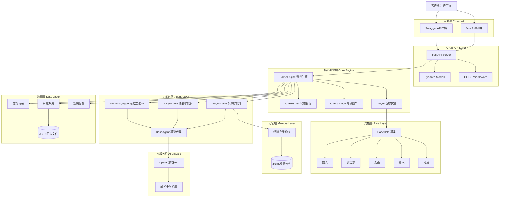
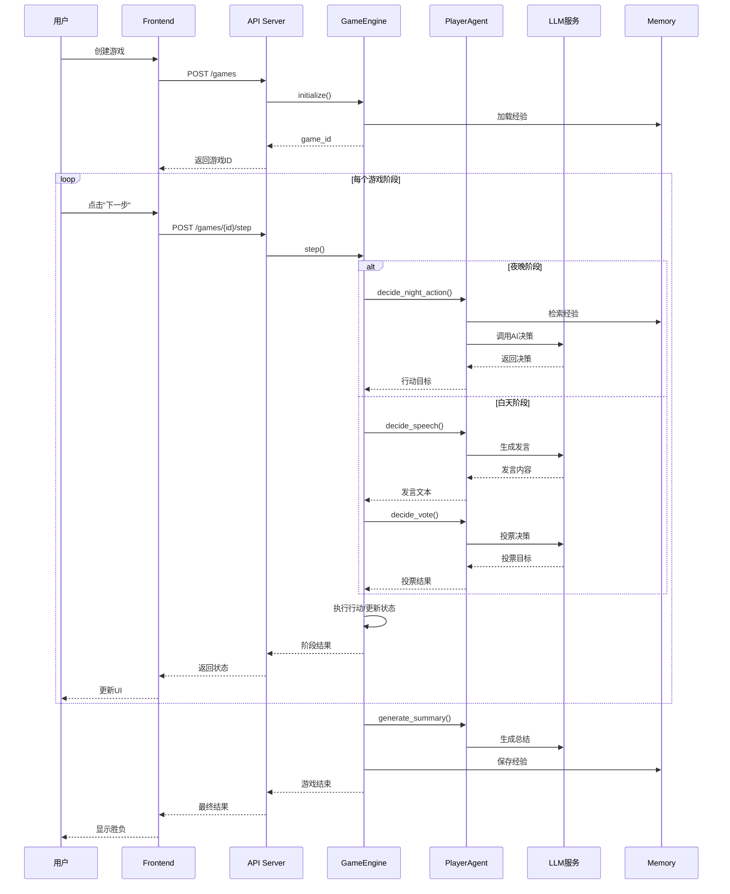

# evo-werewolf-agent 项目架构文档

## 📐 系统架构总览



## 🏗️ 分层架构详解

### 1. 前端展示层 (Presentation Layer)

**技术栈**: Vue 3 + Vite

**核心组件**:
- `GameSetup.vue` - 游戏创建与配置界面
- `GameBoard.vue` - 游戏主面板，展示玩家状态
- `PlayerCard.vue` - 玩家信息卡片
- `GameLog.vue` - 实时游戏日志滚动显示

**通信方式**:
- 通过 Vite Proxy 代理请求到后端 `/games` 和 `/configs` 端点
- 自动轮询或手动触发获取游戏状态更新

### 2. API接口层 (API Layer)

**框架**: FastAPI

**核心端点**:
| 方法 | 路径 | 功能 |
|------|------|------|
| GET | `/` | 健康检查 |
| POST | `/games` | 创建新游戏 |
| POST | `/games/{id}/step` | 推进游戏阶段 |
| GET | `/games/{id}` | 获取游戏状态 |
| GET | `/games` | 列出所有游戏 |
| DELETE | `/games/{id}` | 删除游戏 |
| GET | `/configs` | 列出可用配置 |

**数据模型** (`api/models.py`):
- `CreateGameRequest` - 创建游戏请求
- `StepResponse` - 阶段推进响应
- `GameStatusResponse` - 游戏状态响应
- `GameSummaryResponse` - 游戏摘要响应

### 3. 游戏引擎层 (Game Engine Layer)

**核心类**: `GameEngine`

**职责**:
1. 游戏流程控制（日夜循环）
2. 阶段调度（狼人杀人→预言家查验→女巫用药→发言→投票）
3. 胜负判定
4. 玩家状态管理
5. 日志记录协调

**关键方法**:
- `initialize()` - 初始化游戏，分配角色
- `start()` - 启动完整游戏循环
- `step()` - 单步推进（API模式使用）
- `_night_phase()` - 执行夜晚阶段
- `_day_phase()` - 执行白天阶段
- `_end_game()` - 游戏结束处理

**状态管理** (`engine/state.py`):
```python
GameState:
  - players: List[Player]        # 玩家列表
  - phase: GamePhase             # 当前阶段
  - day_number: int              # 当前天数
  - night_deaths: List[int]      # 夜晚死亡列表
  - dialogues: List[Dict]        # 对话记录
  - vote_records: Dict           # 投票记录
```

**阶段枚举** (`engine/phase.py`):
```python
GamePhase:
  - NIGHT_WOLF       # 狼人杀人
  - NIGHT_SEER       # 预言家查验
  - NIGHT_WITCH      # 女巫用药
  - NIGHT_RESULT     # 夜晚结果宣布
  - DAY_START        # 白天开始
  - SPEECH           # 公开演讲
  - VOTE             # 投票环节
  - DAY_END          # 一天结束
```

### 4. 智能体层 (Agent Layer)

**基础架构**: 基于 `openai-agents` SDK

**核心类**:

#### BaseAgent (基础代理)
```python
BaseAgent:
  - agent: Agent          # openai-agents Agent实例
  - run(input)            # 执行对话
```

#### PlayerAgent (玩家代理)
```python
PlayerAgent:
  - player_id: int
  - role_name: str
  - camp: str
  - decision_style: str   # bold/cautious/balanced/random
  - decide_night_action() # 夜晚行动决策
  - decide_speech()       # 发言生成
  - decide_vote()         # 投票决策
```

#### JudgeAgent (法官代理)
- 负责游戏流程说明
- 规则解释和公告生成

#### SummaryAgent (总结代理)
- 游戏结束后生成玩家总结
- 提取策略、教训和建议

**Agent工作流**:
```
私有上下文构建 → 经验检索 → Prompt组装 → LLM调用 → 决策解析 → 执行
```

### 5. 角色层 (Role Layer)

**继承体系**:
```
BaseRole (基类)
  ├── Werewolf (狼人)
  ├── Seer (预言家)
  ├── Witch (女巫)
  ├── Hunter (猎人)
  └── Villager (村民)
```

**核心属性**:
```python
BaseRole:
  - player_id: int
  - is_alive: bool
  - is_sheriff: bool
  
  方法:
  - is_night_actionable()    # 是否有夜间行动
  - get_night_action()       # 获取夜间行动
  - can_speak()              # 是否可以发言
  - get_speech()             # 生成发言
  - can_vote()               # 是否可以投票
  - get_vote_target()        # 获取投票目标
  - on_death()               # 死亡回调
  - check_win()              # 胜负检查
  - get_private_context()    # 获取私有上下文
```

**角色特殊能力**:
- **Werewolf**: 夜间集体投票杀人
- **Seer**: 夜间查验一人身份（好人/狼人）
- **Witch**: 解药救人 + 毒药杀人（互斥，不可自救）
- **Hunter**: 死亡时开枪带走一人（被毒不能开枪）
- **Villager**: 无特殊能力，纯靠推理

### 6. 记忆层 (Memory Layer)

**经验存储系统** (`memory/experience.py`):

**存储结构**:
```
memory/experiences/
  ├── werewolf.json
  ├── seer.json
  ├── witch.json
  ├── hunter.json
  └── villager.json
```

**经验数据格式**:
```json
{
  "game_id": "game_20260519_012449",
  "player_id": 0,
  "player_name": "玩家1",
  "camp": "evil",
  "winner": "evil",
  "is_winner": true,
  "summary": "本场比赛我作为狼人...",
  "strategies": "与狼同伴配合...",
  "mistakes": "在第三天发言时...",
  "lessons": "下次应该更谨慎..."
}
```

**使用方式**:
- 游戏结束后自动保存经验
- 新游戏开始时检索最近3条经验
- 将经验注入Agent的Prompt中

### 7. 数据层 (Data Layer)

**游戏记录** (`schema/game_record.py`):
- 完整记录对局信息
- 包含角色分配、对话、死亡记录、胜负结果
- 保存为JSON文件到 `logs/` 目录

**日志系统** (`schema/game_logger.py`):
- 结构化日志记录
- 分级日志（DEBUG/INFO/WARNING/ERROR）
- 记录类型：行动、发言、投票、死亡、事件

**系统配置** (`schema/system_config.py`):
```json
{
  "base_url": "https://dashscope.aliyuncs.com/compatible-mode/v1",
  "api_key": "sk-xxx",
  "default_model": "qwen-flash"
}
```

## 🔄 数据流图

### 完整游戏流程



## 📦 模块依赖关系

```
api.server
  ├── api.models
  ├── engine.game_engine
  └── fastapi

engine.game_engine
  ├── engine.state
  ├── engine.phase
  ├── engine.player
  ├── roles.* (所有角色)
  ├── agent.player_agent
  ├── agent.summary_agent
  └── memory.experience

agent.player_agent
  ├── agent.base
  ├── memory.experience
  └── openai-agents

roles.*
  └── roles.base

memory.experience
  └── json/os (标准库)

schema.*
  ├── pydantic
  └── json
```

## 🎯 设计模式应用

### 1. 策略模式 (Strategy Pattern)
- **应用**: 不同角色的决策逻辑
- **实现**: 各角色类实现各自的 `get_night_action()`、`get_speech()` 等方法

### 2. 状态模式 (State Pattern)
- **应用**: 游戏阶段管理
- **实现**: `GamePhase` 枚举 + `GameState` 状态机

### 3. 工厂模式 (Factory Pattern)
- **应用**: 角色和Agent创建
- **实现**: 
  - `GameEngine._create_role()` 创建角色实例
  - `create_player_agent()` 创建玩家代理

### 4. 观察者模式 (Observer Pattern)
- **应用**: 日志系统
- **实现**: `GameLogger` 监听游戏引擎事件

### 5. 模板方法模式 (Template Method Pattern)
- **应用**: Agent决策流程
- **实现**: `BaseAgent.run()` 定义流程，子类实现具体逻辑

## 🔧 技术栈总结

| 层级 | 技术 | 版本要求 |
|------|------|---------|
| 前端 | Vue 3 | ^3.5.0 |
| 前端构建 | Vite | ^5.4.0 |
| 后端框架 | FastAPI | >=0.104.0 |
| ASGI服务器 | Uvicorn | >=0.24.0 |
| 数据验证 | Pydantic | >=2.0 |
| AI框架 | openai-agents | latest |
| HTTP客户端 | httpx | >=0.25.0 |
| 测试 | pytest | >=7.0 |
| 异步测试 | pytest-asyncio | >=0.21.0 |

## 📁 目录结构

```
evo-werewolf-agent/
├── agent/                    # 智能体层
│   ├── base.py              # 基础代理类
│   ├── player_agent.py      # 玩家代理
│   └── summary_agent.py     # 总结代理
├── api/                      # API层
│   ├── server.py            # FastAPI应用
│   └── models.py            # 数据模型
├── engine/                   # 游戏引擎层
│   ├── game_engine.py       # 游戏引擎核心
│   ├── state.py             # 状态管理
│   ├── phase.py             # 阶段定义
│   └── player.py            # 玩家实体
├── roles/                    # 角色层
│   ├── base.py              # 角色基类
│   ├── werewolf.py          # 狼人
│   ├── seer.py              # 预言家
│   ├── witch.py             # 女巫
│   ├── hunter.py            # 猎人
│   └── villager.py          # 村民
├── memory/                   # 记忆层
│   ├── experience.py        # 经验存储
│   └── experiences/         # 经验数据文件
├── schema/                   # 数据模式
│   ├── game_record.py       # 游戏记录
│   ├── game_logger.py       # 日志系统
│   └── system_config.py     # 系统配置
├── frontend/                 # 前端应用
│   ├── src/
│   │   ├── components/      # Vue组件
│   │   ├── App.vue
│   │   ├── api.js
│   │   └── main.js
│   └── package.json
├── config/                   # 配置文件
│   └── system_config.json   # AI服务配置
├── logs/                     # 日志文件
├── tests/                    # 测试代码
├── main_demo.py              # 演示入口
└── requirements.txt          # 依赖清单
```
