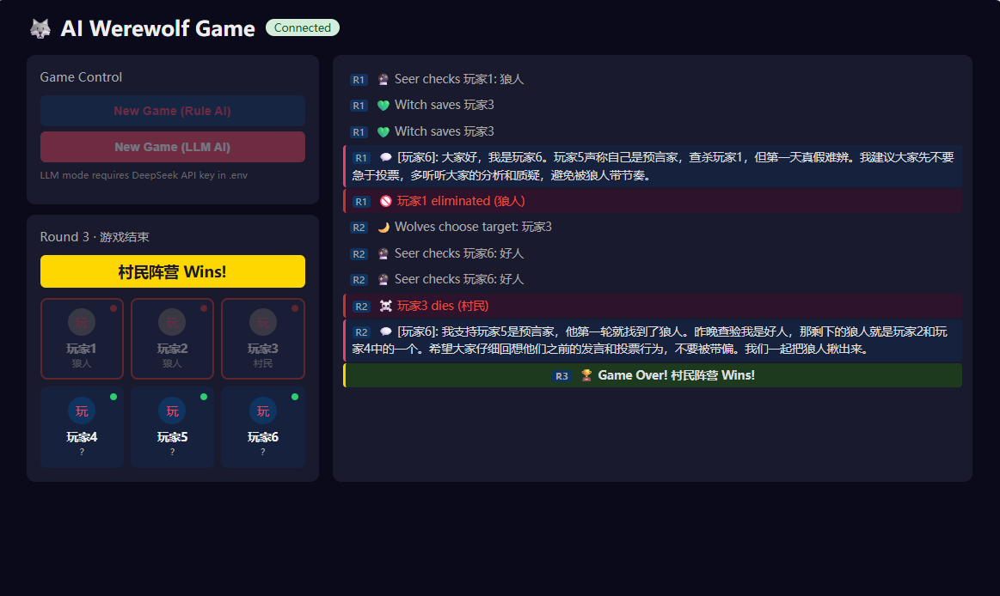

# 🐺 AI Werewolf Game — 多智能体协作与博弈 AgentTeam

基于 DeepSeek-v4 大模型的 AI 狼人杀对战系统，6 个独立 Agent 在信息不对称约束下进行推理、欺骗、协作与对抗。



---

## 项目简介

这是一个多智能体（Multi-Agent）协作与博弈的实战项目。每局游戏由 6 个 AI Agent 分别扮演**狼人、预言家、女巫、村民**，在严格信息隔离的条件下独立推理和决策，完成完整的狼人杀对局。

核心亮点：
- **信息不对称博弈**：每个 Agent 只能看到自己角色应有的信息，狼人互相认识但好人各自为战
- **LLM 驱动推理**：Agent 通过 DeepSeek-v4 模型进行自然语言推理，输出结构化决策
- **完整对局引擎**：状态机驱动的回合流转（夜晚→白天→投票），规则引擎裁决胜负
- **前端实时观战**：Vue 3 观战 UI，WebSocket 实时推送对局事件
- **自演化记忆**：Agent 从对局经验中学习，历史经验自动注入后续对局

---

## 快速开始

### 环境要求

| 组件 | 版本 |
|------|------|
| Python | 3.12 (conda py312) |
| Node.js | v22+ |
| DeepSeek API Key | [获取地址](https://platform.deepseek.com) |

### 1. 后端配置

```powershell
conda activate py312
cd backend
pip install -r requirements.txt
copy .env.example .env
# 编辑 .env，填入 DEEPSEEK_API_KEY
```

### 2. 前端配置

```powershell
cd frontend
npm install
```

### 3. 启动

终端1 — 后端（端口 8765）：
```powershell
cd backend
python werewolf/server.py
```

终端2 — 前端（端口 5173）：
```powershell
cd frontend
npm run dev
```

浏览器打开 `http://localhost:5173`，点击 **New Game (LLM AI)** 开始 AI 对战。

### 终端模式（无需前端）

```powershell
cd backend
python werewolf/main.py       # 规则AI 快速对战
python werewolf/main_llm.py   # DeepSeek LLM 对战
```

---

## 两种 AI 模式

项目支持两种 Agent 运行模式，可通过前端按钮或终端命令切换。

### Rule AI（规则 AI）

基于硬编码启发式策略的轻量模式，**无需网络和 API Key**，适合快速验证游戏引擎逻辑。

| 特性 | 说明 |
|------|------|
| 原理 | 预定义的 if-else 规则（随机选目标、简单发言模板） |
| 延迟 | 毫秒级，即时响应 |
| 费用 | 免费，完全本地运行 |
| 发言 | 从固定模板库随机抽取 |
| 策略 | 狼人随机杀人、女巫首夜必救、预言家随机查验 |
| 适用 | 开发调试、引擎测试、快速演示 |

**启动方式：**
- 前端点击 `New Game (Rule AI)`
- 终端运行 `python werewolf/main.py`

### LLM AI（DeepSeek 大模型）

基于 DeepSeek-v4 的真实推理模式，每个 Agent 独立调用大模型进行**自然语言推理和策略决策**，是项目的核心能力。

| 特性 | 说明 |
|------|------|
| 原理 | 每个 Agent 根据角色 Prompt + 可见信息调用 DeepSeek API，输出结构化 JSON 行动 |
| 延迟 | 每步决策约 1-3 秒（取决于 API 响应速度） |
| 费用 | 按 DeepSeek API 用量计费（约 0.14 美元/百万 token 输入） |
| 发言 | LLM 根据对局上下文**动态生成**，包含推理和策略 |
| 策略 | **自主推理**——狼人会伪装、预言家会报查验、女巫会判断用药时机 |
| 适用 | 正式对战、智能体博弈观察、Prompt 工程研究 |

**启动方式：**
- 前端点击 `New Game (LLM AI)`
- 终端运行 `python werewolf/main_llm.py`

### 两种模式对比

```
Rule AI:   玩家状态 → 规则匹配 → 固定模板输出 → 行动
LLM AI:    玩家状态 → 信息过滤 → Prompt构造 → DeepSeek推理 → JSON解析 → 行动
                                  ↑
                            角色System Prompt
                            历史经验注入（自演化）
```

**LLM 失败回退**：当 DeepSeek API 不可用或返回无效结果时，LLM Agent **自动回退到 Rule AI**，保证对局不会中断。这使得 LLM 模式在未配置 API Key 时仍然可以运行（实际以 Rule AI 逻辑执行）。

### Prompt 设计要点

每个角色的 System Prompt 包含：
- **角色身份**与阵营归属（狼人阵营 vs 村民阵营）
- **胜利条件**（消灭所有好人 vs 消灭所有狼人）
- **可用行动**与约束（夜晚杀谁、查验谁、是否用药）
- **信息边界**（例如狼人知道同伴身份、预言家知道查验历史）
- **行为指引**（狼人伪装好人、预言家引导投票、女巫谨慎用药）

当前 Phase 的策略指令会在每晚行动和白天发言/投票时拼接，要求 LLM 输出包含 `reasoning` 字段的结构化 JSON，保证决策可解释、可审计。

---

## 项目结构

```
Werewolf-Game/
├── docs/                        # 开发文档 + 截图
│   ├── 01-requirements.md       # 开发目标与要求
│   ├── 02-architecture.md       # 技术架构
│   ├── 03-development-plan.md   # 敏捷开发计划
│   ├── 04-progress.md           # 开发进度
│   └── 05-environment.md        # 环境配置
├── backend/
│   ├── werewolf/
│   │   ├── engine.py            # 游戏引擎（状态机+规则+角色+规则AI）
│   │   ├── agent.py             # LLM Agent（DeepSeek客户端+信息过滤+Prompt）
│   │   ├── evolution.py         # 自演化记忆系统
│   │   ├── server.py            # FastAPI + WebSocket 服务
│   │   ├── main.py              # 终端入口（规则AI）
│   │   └── main_llm.py          # 终端入口（LLM AI）
│   ├── tests/                   # 37项自动化测试
│   ├── requirements.txt
│   └── .env.example
├── frontend/
│   └── src/
│       ├── App.vue              # 主布局 + WebSocket 逻辑
│       └── components/
│           ├── GameBoard.vue    # 玩家状态面板
│           ├── ChatLog.vue      # 实时事件日志流
│           └── GameControl.vue  # 游戏控制按钮
└── README.md
```

---

## 游戏角色

| 角色 | 阵营 | 能力 | 数量 |
|------|------|------|------|
| 🐺 狼人 | 狼人 | 每晚杀害一名玩家 | 2 |
| 🔮 预言家 | 村民 | 每晚查验一名玩家身份 | 1 |
| 🧪 女巫 | 村民 | 拥有一瓶解药+一瓶毒药 | 1 |
| 👤 村民 | 村民 | 无特殊能力，靠推理投票 | 2 |

狼人胜利条件：存活狼人数 ≥ 存活村民数
村民胜利条件：所有狼人被消灭

---

## 技术架构

```
Vue 3 Frontend  ←─WebSocket─→  FastAPI Server
                                   │
                              Game Engine
                         (StateMachine + RuleEngine)
                                   │
                              Agent System
                    (InfoFilter + LLMClient + Prompts)
                                   │
                           DeepSeek v4-flash API
```

- **信息隔离**：`InfoFilter` 根据角色和当前阶段，从完整游戏状态中提取每个 Agent 的可见信息子集
- **回退机制**：LLM 调用失败时自动回退到规则 AI，保证对局不中断
- **结构化输出**：LLM 输出 JSON 格式决策，包含 `reasoning`（推理过程）和具体行动

---

## 开发阶段

| 阶段 | 内容 | 测试 |
|------|------|------|
| Phase 1 | 游戏引擎 + 规则AI | 21 项 ✓ |
| Phase 2 | DeepSeek LLM Agent 集成 | 10 项 ✓ |
| Phase 3 | FastAPI + Vue3 前端 | — |
| Phase 4 | 自演化记忆 + 集成测试 | 6 项 ✓ |

全部 **37 项测试通过**。

---

## API 接口

| 方法 | 路径 | 说明 |
|------|------|------|
| POST | `/api/games?use_llm=true` | 创建新游戏 |
| GET | `/api/games/{id}` | 查询游戏状态 |
| WS | `/ws/{game_id}` | 实时事件推送 |

---

## 环境变量

在 `backend/.env` 中配置：

```env
DEEPSEEK_API_KEY=sk-your-key
DEEPSEEK_BASE_URL=https://api.deepseek.com/v1
DEEPSEEK_MODEL=deepseek-v4-flash
PORT=8765    # 可选，默认 8765
```
