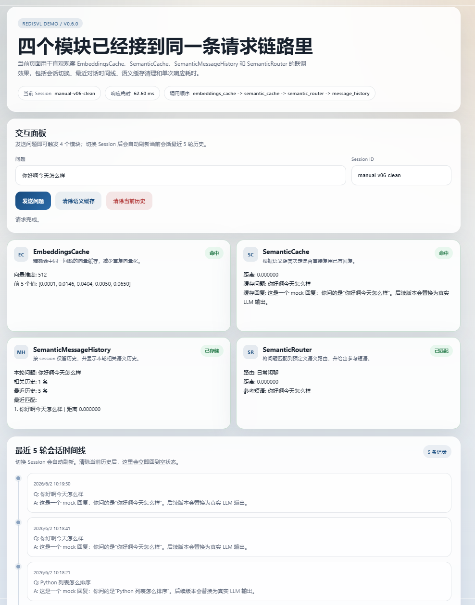

# 简易版 RedisVL Python Demo

一个基于 Redis Stack、FastAPI 和本地向量模型的最小化 RedisVL 演示项目。

当前仓库已经完成 `V0.6.0`，具备完整的前后端联调能力、会话历史管理、语义缓存清理能力，以及覆盖核心流程的自动化测试。



## 项目目标

这个项目用于演示 Redis 在 AI 应用中的几类常见能力：

- `EmbeddingsCache`：缓存文本向量，避免重复向量化
- `SemanticCache`：缓存语义相近问题的回答
- `SemanticMessageHistory`：按会话保存并检索语义相关的历史消息
- `SemanticRouter`：把用户问题路由到预定义语义类别

项目同时提供了一个可直接操作的 Web 页面，用来观察这 4 个模块在一次请求中的执行结果。

## 当前版本状态

- 当前版本：`V0.6.0`
- 开发状态：已完成
- 自动化测试结果：`34 passed`
- 当前覆盖率：`85%`

这一版已经支持：

- 首页直接发起对话请求
- `Session ID` 持久化到浏览器本地存储
- 显示当前响应耗时和模块调用链路
- 展示最近 5 轮会话时间线
- 清除当前会话历史
- 清除全局语义缓存
- 会话隔离、边界输入和 E2E 自动测试

## 技术栈

- Python 3.10
- FastAPI
- Uvicorn
- Redis Stack
- redis-py
- sentence-transformers
- Jinja2
- 原生 HTML + Vanilla JavaScript
- pytest + httpx + pytest-asyncio + pytest-cov

## 目录结构

```text
redis_vl-python/
├─ app/
│  ├─ main.py
│  ├─ config.py
│  ├─ redis_client.py
│  ├─ vectorizer.py
│  ├─ modules/
│  │  ├─ embeddings_cache.py
│  │  ├─ semantic_cache.py
│  │  ├─ message_history.py
│  │  └─ semantic_router.py
│  └─ templates/
│     └─ index.html
├─ docs/
│  ├─ GOAL.md
│  ├─ REQUIREMENTS.md
│  ├─ ROADMAP.md
│  └─ versions/
├─ tests/
├─ docker-compose.yml
├─ requirements.txt
├─ run.py
└─ readme.md
```

## 运行前准备

建议使用当前仓库实际采用的环境：

- Redis Stack 通过 Docker 运行
- Python 环境使用 `conda` 的 `py310`
- 向量模型使用 `sentence-transformers`

如果你本地还没有环境，可以按下面步骤准备。

## 安装依赖

1. 激活 Python 环境

```powershell
conda activate py310
```

2. 安装项目依赖

```powershell
pip install -r requirements.txt
```

## 环境配置

项目通过根目录 `.env` 读取配置。当前仓库里的实际配置如下：

| 配置项 | 当前值 | 说明 |
| --- | --- | --- |
| `REDIS_HOST` | `localhost` | Redis 主机 |
| `REDIS_PORT` | `16379` | Redis 访问端口 |
| `REDIS_HOST_PORT` | `16379` | Docker 暴露端口 |
| `REDIS_INSIGHT_PORT` | `18001` | Redis Insight 端口 |
| `HF_MODEL_NAME` | `BAAI/bge-small-zh-v1.5` | 当前向量模型 |
| `EMBEDDING_DIM` | `512` | 向量维度 |
| `APP_HOST` | `0.0.0.0` | Web 服务监听地址 |
| `APP_PORT` | `18000` | Web 服务端口 |

如果需要切换模型或端口，可以直接修改 `.env`。

## 启动方式

1. 启动 Redis Stack

```powershell
docker compose up -d
```

2. 启动应用

```powershell
python run.py
```

3. 打开浏览器访问

```text
http://localhost:18000
```

4. 健康检查接口

```text
http://localhost:18000/api/health
```

## 页面上可以直接体验的能力

打开首页后，你可以直接验证以下功能：

- 输入 `Python 列表怎么排序`，观察技术问答路由和缓存行为
- 再次输入同样的问题，观察 `EmbeddingsCache` 和 `SemanticCache` 命中
- 输入 `你好啊今天怎么样`，观察命中 `日常闲聊`
- 输入 `3.14 乘以 2`，观察命中 `数学计算`
- 切换 `Session ID`，观察最近 5 轮时间线随会话变化
- 点击“清除当前历史”，观察当前会话历史被清空
- 点击“清除语义缓存”，观察重复问题重新变成未命中

## 核心请求链路

当前 `/api/chat` 的处理顺序为：

```text
embeddings_cache -> semantic_cache -> semantic_router -> message_history
```

其中同一次请求中的向量会被复用，避免重复计算。

## 主要接口

| 方法 | 路径 | 说明 |
| --- | --- | --- |
| `GET` | `/` | 首页演示页面 |
| `GET` | `/api/health` | 健康检查 |
| `POST` | `/api/chat` | 主对话接口 |
| `GET` | `/api/session/history` | 查询指定会话最近历史 |
| `DELETE` | `/api/session/history` | 清除指定会话历史 |
| `DELETE` | `/api/cache/semantic` | 清除语义缓存 |

### `POST /api/chat` 请求示例

```json
{
  "session_id": "demo-session-a",
  "prompt": "Python 列表怎么排序"
}
```

### `POST /api/chat` 返回重点字段

- `response`：最终回复
- `normalized_session_id`：规范化后的会话 ID
- `embeddings_cache`：向量缓存命中状态
- `semantic_cache`：语义缓存命中状态
- `router`：路由结果
- `message_history`：历史消息相关信息
- `timing.response_time_ms`：响应耗时
- `timing.flow`：模块执行顺序

## 测试

运行测试前，请先确保 Redis Stack 已启动，并且不要并行跑多个会使用同一个 Redis DB 的完整测试进程。

### 执行全部测试

```powershell
conda run -n py310 python -m pytest -q tests
```

当前结果：

```text
34 passed
```

### 执行覆盖率检查

```powershell
conda run -n py310 python -m pytest --cov=app --cov-report=term-missing -q tests
```

当前结果：

```text
34 passed
总覆盖率：85%
```

## 文档索引

- 项目目标说明：`docs/GOAL.md`
- 需求说明：`docs/REQUIREMENTS.md`
- 开发路线图：`docs/ROADMAP.md`
- 版本记录：`docs/versions/`
- 当前版本详细说明：`docs/versions/V0.6.0.md`

如果你要做人工验收，建议直接查看 `docs/versions/V0.6.0.md` 中的“手动测试详细流程”。

## 开发说明

- `run.py` 会在启动前先检查 Redis 连通性
- 前端页面位于 `app/templates/index.html`
- 当前页面是最终联调版，不是占位页
- 测试里使用了 Redis 清理逻辑，因此不要把多个完整测试进程同时跑在同一个 Redis DB 上

## 后续可扩展方向

如果要继续迭代，这个项目比较自然的方向包括：

- 接入真实 LLM，替换当前 mock 回复
- 增加更丰富的路由策略和业务标签
- 增加多用户鉴权与隔离
- 为缓存和历史记录增加可配置 TTL
- 补充 Docker 化的一键后端启动和部署说明
